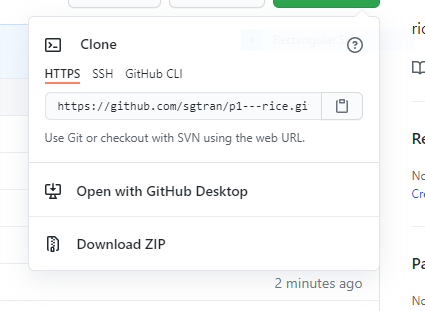
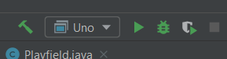
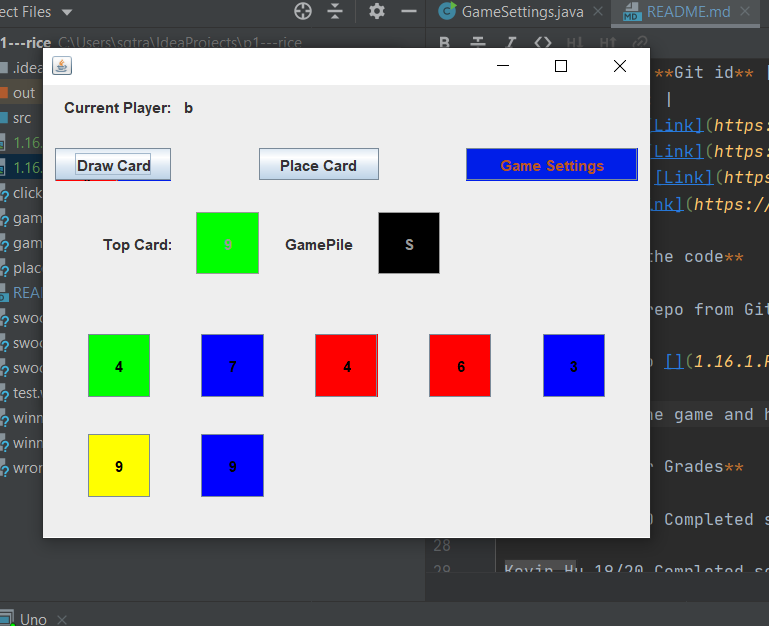

# P1-Rice
**Standard SDK:** Adopt-OpenJ9-15

**Link to Github:** [Here](https://github.com/sgtran/p1---rice)

**Link to scrum board:** [Here](https://github.com/sgtran/p1---rice/projects/1)

**Link to project plan:** [Here](https://docs.google.com/document/d/1J7p0vuNPozwbu0-tjaQCutQNg-10E0QndgibnOdazJU/edit?usp=sharing)

| **Member** | **Git id** |
| :---:   | :-: |
| Sean Tran | [Link](https://github.com/sgtran) |
| Kevin Hu |  [Link](https://github.com/keviin0)  |
| Andrew Pu |  [Link](https://github.com/andrewzpu) |
| Alex Hu | [Link](https://github.com/AlexH04) |

 **How to run the code**    
 
Step 1: clone repo from Git 

Step 2: run Uno 

Step 3: Play the game and hear the sounds and see the bot play 

 

 **Scrum Master Grades**  

Sean Tran 19/20 Completed scrum card however could have improved sound quality of sound.

Kevin Hu 19/20 Completed scrum card however could have tried to merge branches

Andrew Pu 19/20 Completed scrum card however could have done work earlier than later.

Alex Hu 18/20 Was not able to complete scrum card however made genuine effort in his attempts.

| **Scrum Cards Focus** | **Evidence** |
| :---:   | :-: |
|Link to scrum board [here](https://github.com/sgtran/p1---rice/projects/1)|
| Goal 1: Integrate sound into game and buttons -Sean Tran  | In order to run this code. Just run Uno, and the click on the various buttons and play the game to hear the sounds. Added sound to [gameSettings click](https://github.com/sgtran/p1---rice/blob/main/src/ui/UnoUI.javaL#183-189) and [gameSettingClick](https://github.com/sgtran/p1---rice/blob/main/src/ui/UnoUI.java#L191-197). I also added sound to [place card](https://github.com/sgtran/p1---rice/blob/main/src/util/Actions.java#L12-26) for correct and incorrect placement. Added sound for [winner case](https://github.com/sgtran/p1---rice/blob/main/src/ui/UnoUI.java#L200-205). |
| Goal 2: Fix the Thymeleaf template -Kevin Hu | Fixed [Thymeleaf](https://github.com/sgtran/p1---rice/tree/spring/src/main/resources) template. Checkout spring branch, run "SpringSecurityMongodbSecurityApplication" with JDK 15 and download any necessary maven packages. Navigate to http://localhost:8080. |
| Goal 3: Improve bot Algorithms -Andrew Pu |  Created bot algorithm and added to botPlay method in [UnoUi.java](https://github.com/sgtran/p1---rice/blob/main/src/ui/UnoUI.java). Also added code to [Uno.java](https://github.com/sgtran/p1---rice/blob/main/src/ui/Uno.java) and elsewhere in [UnoUI.java](https://github.com/sgtran/p1---rice/blob/main/src/ui/UnoUI.java) to allow botPlay method to be run correctly and access next/previous players. |  |
|        |
| Still in progress objective: Remove forms from UI -Alex Hu| Created [UnoGUI](https://github.com/sgtran/p1---rice/blob/main/src/ui/UnoGUI.java) to make UI work with no forms. However, something did not work so work was reverted and UnoUI is kept as the UI. Will work to fix this issue ASAP.Module dependencies were changed to accomodate some of the packages/jars in the code. UI is still in progress to be improved. |

| **Week** | **Code Updates** |         
| :---:   | :-: |
| *Week 0*| Sean -Set up Repo and ReadMe 12/8 |
|         | Kevin -Move Uno in new repo  12/9|
|         | Andrew -Brainstormed project ideas & made journal  12/9|
|         | Alex -Update User info 12/9|
|         |  
| *Week 1*| Sean - Fixed Uno to run in Intellij properly. 12/16|
|         | Kevin - Helped identify issue where Uno wouldn't run in IntelliJ. Experimenting with Spring Boot framework.|
|         | Andrew - Got more familiar with the code. Added option to add bots, but still working on making them automated|
|         | Alex - No updates yet, got more familiar with the code as this was an existing project from last tri that I did not work on.|
|         |                            |
| *Week 2*| Sean -Set up GameSettings 12/28 |
|         | Kevin -Work on Spring  12/29|
|         | Andrew -Bot code  12/29|
|         | Alex -Work on GUI form conversion 12/29|
|         |
| *Week 3*| Sean -Added sound 1/13 |
|         | Kevin -Fix Thymeleaf  1/14|
|         | Andrew -Improve bot code  1/14|
|         | Alex -Improve UI 1/13|

| **5 hour Challenge** | **Justification and Scrum Master Eval** |         
| :---:   | :-: |
| *Week 1*| **Sean** - Debug [Uno.java](https://github.com/sgtran/p1---rice/blob/main/src/ui/Uno.java) to be able to see the [Playfield.java](https://github.com/sgtran/p1---rice/blob/main/src/util/Playfield.java) in util as well as [Card.java](https://github.com/sgtran/p1---rice/blob/main/src/util/Card.java). Corrected source file settings in project settings and cleared the cache and restarting intellij. **Critical Thinking 5/5**. I communicated my progress as well as assignments and deadlines to my team to make sure everyone is on the same page. **Communication 5/5**. Collaborated with Kevin (pair share partner) and talked about how to implement our project into a website and talk to other teammates about roles **Collaboration 5/5**. Created [GameSettings](https://github.com/sgtran/p1---rice/blob/main/src/ui/GameSettings.java) and created labels. Learning how to make the J-Frame without form took longer than expected to learn. I was not able to add buttons to the GameSetting frame. **Creativity and intangibles 4/5**.        *(I am the Scrum Master) I was able to accomplish most of what I was assigned todo and communicated with my teams assignments and deadlines. I agree with the 4 Cs. I however, did not blow myself away with my work. **4/5***  |
|         | **Kevin** - Aside from identifying that src needed to be marked as src root, I'm working on a Spring Boot registration needed for multiplayer in future (haven't pushed).  Also learning annotations for Spring Boot framework. **Critical Thinking. 5/5** Between experimenting with Spring Boot and communicating the general idea of the initial Uno game itself, I think I could have done a better job introducing the project to the members that aren't familiar with it as well as Sean and I who worked on it last tri. **Communication 4/5**. I made sure that any issues that the code had were addressed promptly so that the code was able to be run and tested. **Collaboration 5/5**. Although I don't have any Spring Boot tangibles I think the ideas I'm playing with and testing are coming together nicely in a fun and interactive way. **Creativity 4/5**        *(Scrum Master Grade) Kevin was good in communication this week and was able to accomplish most of his goals. I agree with the 4Cs however, he did not blow me away. **4/5***|
|         | **Andrew** - Added combo box for bots and changed panel layout in [Uno.java](https://github.com/sgtran/p1---rice/blob/main/src/ui/Uno.java). Bots work as actual players, so currently working on automating them in [UnoUI.java](https://github.com/sgtran/p1---rice/blob/main/src/util/Card.java). **Critical Thinking 4/5**. I only came up with very basic ideas for the bot algorithm and I couldn't figure out how to fully implement the bots. **Communication 5/5**. Talked to Kevin about parts of the code I didn't understand to help gain a better understanding. **Collaboration 5/5**. Connected bot code to the already existing code by working with Kevin and understanding how the other code worked. **Creativity 4/5**.       *(Scrum Master Grade) He did his role for the team. Communicated with teammates. I agree with the 4Cs however work did not blow me away. **4/5*** |
|         | **Alex** - As per the scrum board, researched how online multiplayer games work, what information is most crucial to send to the servers, and how this information could be represented as numbers in a database (for example, Uno could have several server variables for each person such as turn number, number of cards, previous card number and previous card color). **Critical Thinking 5/5**. I researched on my assigned topic and is still continuing to research more about matchmaking and how they find an available player. **Communication 4/5**. Could have done better on communicating ideas with the team and maybe start putting down some points on the scrum board or project plan. **Collaboration 5/5**. Made sure that I understood the code so that I could collaborate better with people that had previously worked on this code and are much more familiar with it. **Creativity 5/5**. I am still planning to continue researching online multiplayer as it may be the biggest and most unfamiliar struggle we will run into this trimester.         *(Scrum Master Grade) I agree with the 4Cs. Communicated work with group. I appreciate he did his work earlier than later. His work however, did not blow me away. **4/5*** |

 
