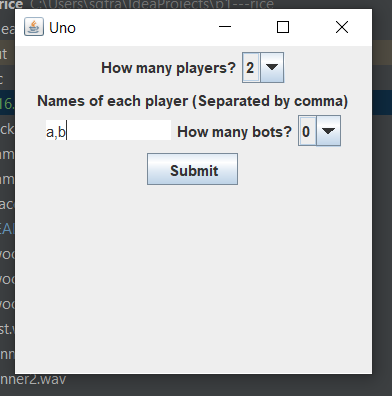
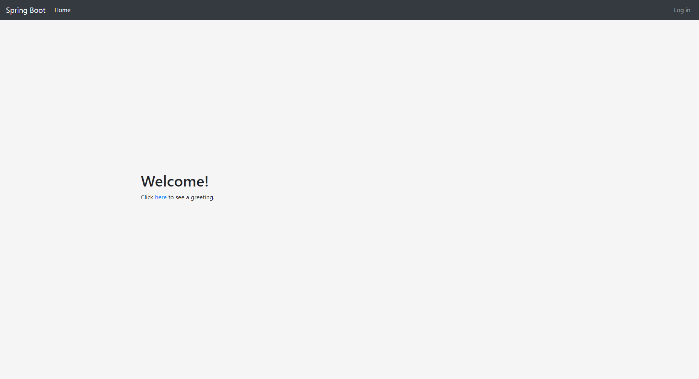
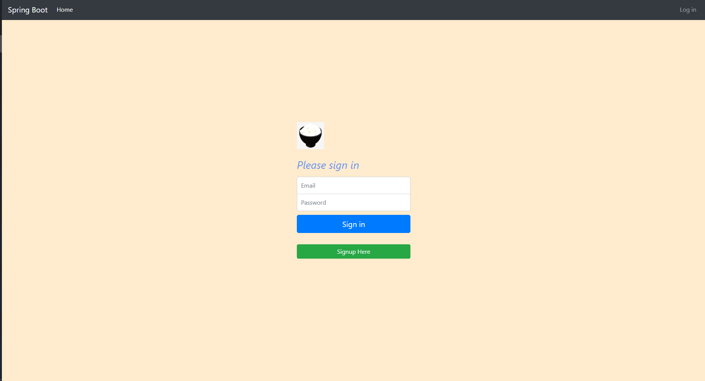
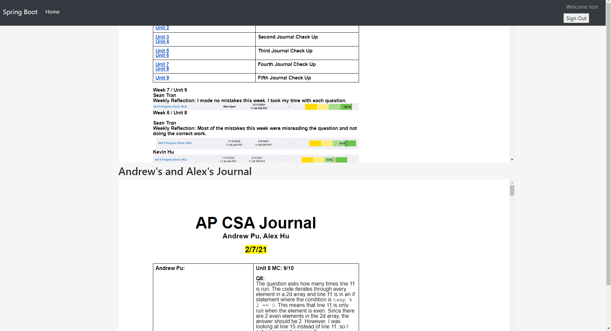

# P1-Rice
**Standard SDK:** Adopt-OpenJ9-15

**Link to Github:** [Here](https://github.com/sgtran/p1---rice)

**Link to scrum board:** [Here](https://github.com/sgtran/p1---rice/projects/1)

**Link to project plan:** [Here](https://docs.google.com/document/d/1J7p0vuNPozwbu0-tjaQCutQNg-10E0QndgibnOdazJU/edit?usp=sharing)

**Link to website** [here](http://ec2-13-57-248-92.us-west-1.compute.amazonaws.com:8080)

| **Member** | **Git id** |
| :---:   | :-: |
| Sean Tran | [Link](https://github.com/sgtran) |
| Kevin Hu |  [Link](https://github.com/keviin0)  |
| Andrew Pu |  [Link](https://github.com/andrewzpu) |
| Alex Hu | [Link](https://github.com/AlexH04) |

| **Technical** | **Description** |
| :---:   | :-: |
| Mongo DB -Andrew | We were able to successfully use MongoDB in our project to store user information, which allowed us to create a login system. In order to set up our database, we mostly did personal research outside of class by experimenting with the program, and we made changes to our already existing database as we learned about MongoDB through class and collaboration. For the future of our project, we can use the database to hold more information about each user, such as their total score and win rate, which would give a purpose to the user account system. Our use of MongoDB can be seen in our project [here](https://github.com/sgtran/p1---rice/blob/main/src/main/java/com/example/demo/models/Role.java) and [here](https://github.com/sgtran/p1---rice/blob/main/src/main/java/com/example/demo/repository/UserRepository.java). |
| MVC-Alex | MVC has been implemented in the project since it was first created last trimester. However, the main difference between the two trimesters so far is that in the first tri, the [view portions](./src/ui/UnoGUI.java) were handled by a GUI form while this tri we removed the form and put it JFrame code so that our game would run on Repl.it which we used to embed the game into a website. The [Actions file](./src/util/Actions.java) handles the controller aspect, while the model is being handled by the  [Special Actions file](./src/util/SpecialActions.java). This organization was crucial to the project as without MVC, we would not be able to remove the GUI From effectively and place the JFrame code in a separate file. MVC was also used for organizing the Spring and HTML files, which Kevin will show below. |
| Spring -Kevin | Using Spring we were able to use annotations (specifically Autowired and Bean) to simplify the MVC model of the web app ([Model](./src/main/java/com/example/demo/models),[View](./src/main/resources/templates), [Control](./src/main/java/com/example/demo/controller)).  Using Spring also allowed for easier MongoDB integration ([Here](./src/main/java/com/example/demo/service/CustomUserDetailsService.java)) with the web app so that the Spring app could handle juggling both permissions for a user, and their ability to login. This was made possible with Spring specific annotations such as DBRef which automatically configures the setter and getters with the DB. |
| Audio-Sean | We were able to achieve having sound in our game. Sound works if you run our code from Intellij. In order to have the game work on our website we needed to use Repl. Repl does not support the sound that we use. Next trimester we will take a look and see if we can get sound to work on the website if possible. The audio was from personal research outside of class. We used the javax.sound.sampled and AudioStream to play music from wav files stored in our repo. Resources that we used to help us with this process are [youtube](https://www.youtube.com/watch?v=3q4f6I5zi2w) and [stack overflow](https://stackoverflow.com/questions/26305/how-can-i-play-sound-in-java). Sound is used for almost every click in our game. [Here](https://github.com/sgtran/p1---rice/blob/main/src/util/Actions.java#L12-L17) is an example of code that makes sound be played when a player palces a correct card. [Here](https://github.com/sgtran/p1---rice/blob/main/src/ui/UnoGUI.java#L209-L214) is an example of code that plays a draw card.  |

_____________________________________________________________________________________

 **How to run the code for the game from Intellij**    
 
Step 1: clone repo from Git 

Step 2: run Uno 

Step 3: Play the game and hear the sounds and see the bot play 

 

## **ReadMe Guide me** 

This table shows the tickets and completion evidence.
| **Ticket Review** | **Evidence** |
| :---:   | :-: |
|Link to scrum board [here](https://github.com/sgtran/p1---rice/projects/2)|
| [Ticket 1](https://github.com/sgtran/p1---rice/issues/22): Fix image on log in page add more details to journal page -Sean Tran  | Fixed logo on log in page by centering it using a [class](https://github.com/sgtran/p1---rice/blob/main/src/main/resources/templates/login.html#L12-15). Centered the title on the log in page by using a class and changing some [settings](https://github.com/sgtran/p1---rice/blob/main/src/main/resources/templates/login.html#L17). Added logo on log in [page](https://github.com/sgtran/p1---rice/blob/main/src/main/resources/templates/dashboard.html#L20). Put title in log in [page](https://github.com/sgtran/p1---rice/blob/main/src/main/resources/templates/dashboard.html#L18). |
| [Ticket 2](https://github.com/sgtran/p1---rice/issues/20): Integrate game into website -Kevin Hu | [JAR](./out/artifacts/p1___rice_jar/demo-0.0.1-SNAPSHOT.jar) for web presence error free |
| [Ticket 3](https://github.com/sgtran/p1---rice/issues/21): Create Leaderboard -Andrew Pu | Changed scoring and added leaderboard in [player class](https://github.com/sgtran/p1---rice/blob/main/src/util/Player.java). Still working on adding leaderboard to display score data in MongoDB database |
| [Ticket 4](https://github.com/sgtran/p1---rice/issues/19): Clean Up Journal Presentation -Alex Hu|Learned and added JavaScript for hiding the iframes and only showing them when buttons are pressed using display:none (https://github.com/sgtran/p1---rice/blob/main/src/main/resources/templates/dashboard.html#L24)|

This table shows Front End Progress and Visuals.
| **Front End Progress** | **Evidence** |
| :---:   | :-: |
| Link to website (from padlet) [here](http://ec2-13-57-248-92.us-west-1.compute.amazonaws.com:8080)|
| The Spring webapp is hosted on an EC2 with the [JAR](./out/artifacts/p1___rice_jar/demo-0.0.1-SNAPSHOT.jar) being kept alive 24/7 with PM2 from NodeJS.  |  |
| Register an account by pressing log in and clicking sign up. You can also use the following credentials (Username: test@gmail.com password: test) |  |
| Once registered, log in and access the dashboard where the journals are located.| |

This table talks about Code Review and feedback.
| **Code Review and Feedback** | **Evidence** |
| :---:   | :-: |
| From crossover event, we learned how to implemented embedded journals  | This can be seen in completed Ticket 4 |
| We also are trying to figure how to embed our game into the website. That is still in progress, however we plan to use Repl to help us embed our game.|

End of ReadMe Guide

| **Week** | **Code Updates** |         
| :---:   | :-: |
| *Week 0*| Sean -Set up Repo and ReadMe 12/8 |
|         | Kevin -Move Uno in new repo  12/9|
|         | Andrew -Brainstormed project ideas & made journal  12/9|
|         | Alex -Update User info 12/9|
|         |  
| *Week 1*| Sean - Fixed Uno to run in Intellij properly. 12/16|
|         | Kevin - Helped identify issue where Uno wouldn't run in IntelliJ. Experimenting with Spring Boot framework.|
|         | Andrew - Got more familiar with the code. Added option to add bots, but still working on making them automated|
|         | Alex - No updates yet, got more familiar with the code as this was an existing project from last tri that I did not work on.|
|         |                            |
| *Week 2*| Sean -Set up GameSettings 12/28 |
|         | Kevin -Work on Spring  12/29|
|         | Andrew -Bot code  12/29|
|         | Alex -Work on GUI form conversion 12/29|
|         |
| *Week 3*| Sean -Added sound 1/13 |
|         | Kevin -Fix Thymeleaf  1/14|
|         | Andrew -Improve bot code  1/14|
|         | Alex -Improve UI 1/13|

| **5 hour Challenge** | **Justification and Scrum Master Eval** |         
| :---:   | :-: |
| *Week 1*| **Sean** - Debug [Uno.java](https://github.com/sgtran/p1---rice/blob/main/src/ui/Uno.java) to be able to see the [Playfield.java](https://github.com/sgtran/p1---rice/blob/main/src/util/Playfield.java) in util as well as [Card.java](https://github.com/sgtran/p1---rice/blob/main/src/util/Card.java). Corrected source file settings in project settings and cleared the cache and restarting intellij. **Critical Thinking 5/5**. I communicated my progress as well as assignments and deadlines to my team to make sure everyone is on the same page. **Communication 5/5**. Collaborated with Kevin (pair share partner) and talked about how to implement our project into a website and talk to other teammates about roles **Collaboration 5/5**. Created [GameSettings](https://github.com/sgtran/p1---rice/blob/main/src/ui/GameSettings.java) and created labels. Learning how to make the J-Frame without form took longer than expected to learn. I was not able to add buttons to the GameSetting frame. **Creativity and intangibles 4/5**.        *(I am the Scrum Master) I was able to accomplish most of what I was assigned todo and communicated with my teams assignments and deadlines. I agree with the 4 Cs. I however, did not blow myself away with my work. **4/5***  |
|         | **Kevin** - Aside from identifying that src needed to be marked as src root, I'm working on a Spring Boot registration needed for multiplayer in future (haven't pushed).  Also learning annotations for Spring Boot framework. **Critical Thinking. 5/5** Between experimenting with Spring Boot and communicating the general idea of the initial Uno game itself, I think I could have done a better job introducing the project to the members that aren't familiar with it as well as Sean and I who worked on it last tri. **Communication 4/5**. I made sure that any issues that the code had were addressed promptly so that the code was able to be run and tested. **Collaboration 5/5**. Although I don't have any Spring Boot tangibles I think the ideas I'm playing with and testing are coming together nicely in a fun and interactive way. **Creativity 4/5**        *(Scrum Master Grade) Kevin was good in communication this week and was able to accomplish most of his goals. I agree with the 4Cs however, he did not blow me away. **4/5***|
|         | **Andrew** - Added combo box for bots and changed panel layout in [Uno.java](https://github.com/sgtran/p1---rice/blob/main/src/ui/Uno.java). Bots work as actual players, so currently working on automating them in [UnoUI.java](https://github.com/sgtran/p1---rice/blob/main/src/util/Card.java). **Critical Thinking 4/5**. I only came up with very basic ideas for the bot algorithm and I couldn't figure out how to fully implement the bots. **Communication 5/5**. Talked to Kevin about parts of the code I didn't understand to help gain a better understanding. **Collaboration 5/5**. Connected bot code to the already existing code by working with Kevin and understanding how the other code worked. **Creativity 4/5**.       *(Scrum Master Grade) He did his role for the team. Communicated with teammates. I agree with the 4Cs however work did not blow me away. **4/5*** |
|         | **Alex** - As per the scrum board, researched how online multiplayer games work, what information is most crucial to send to the servers, and how this information could be represented as numbers in a database (for example, Uno could have several server variables for each person such as turn number, number of cards, previous card number and previous card color). **Critical Thinking 5/5**. I researched on my assigned topic and is still continuing to research more about matchmaking and how they find an available player. **Communication 4/5**. Could have done better on communicating ideas with the team and maybe start putting down some points on the scrum board or project plan. **Collaboration 5/5**. Made sure that I understood the code so that I could collaborate better with people that had previously worked on this code and are much more familiar with it. **Creativity 5/5**. I am still planning to continue researching online multiplayer as it may be the biggest and most unfamiliar struggle we will run into this trimester.         *(Scrum Master Grade) I agree with the 4Cs. Communicated work with group. I appreciate he did his work earlier than later. His work however, did not blow me away. **4/5*** |

 
